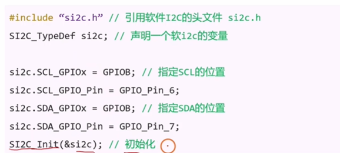
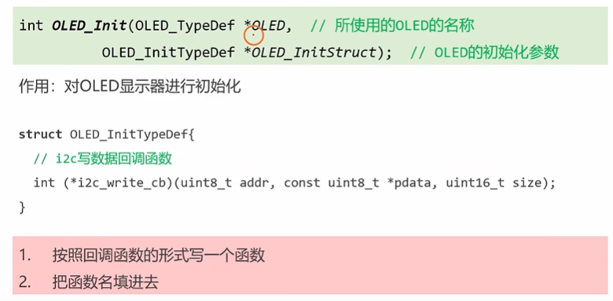
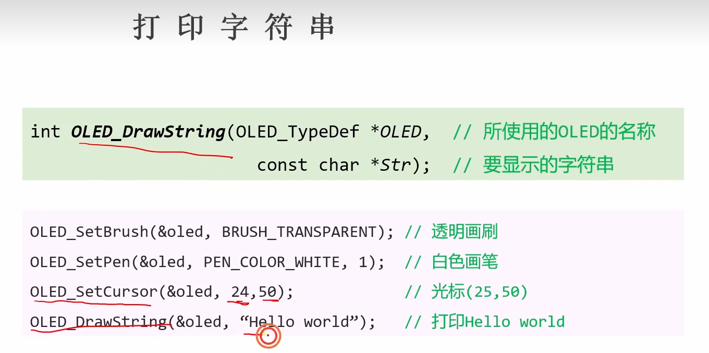

##### 1_oled

###### 1.1基本原理

​	mcu可以通过I2C对屏幕上的内存进行读写，通过对屏幕上的内存操作对屏幕进行读写，每一个比特位代表一个像素，0熄灭，1点亮，像素越高越清晰

###### 1.2屏幕初始化

​	软I2C和屏幕oled初始化

​	

###### 1.3基础概念和操作

###### 1.4文字相关操作

###### 1.5绘图相关操作

