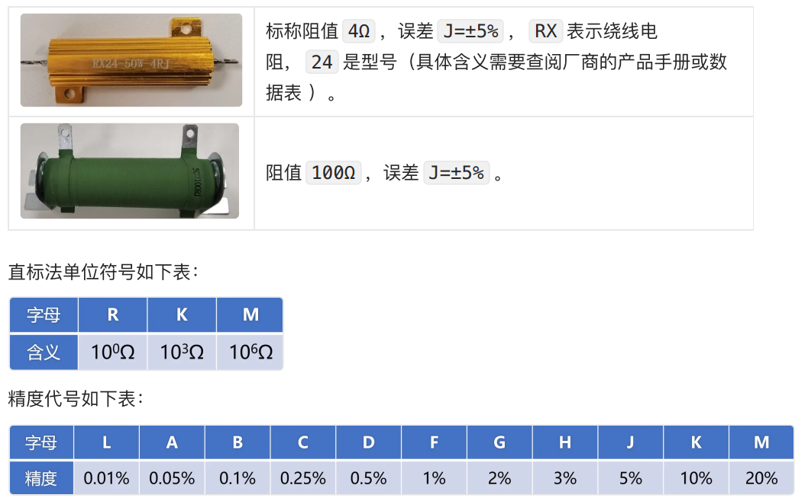
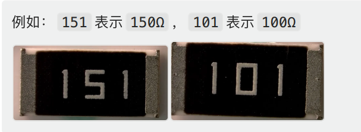
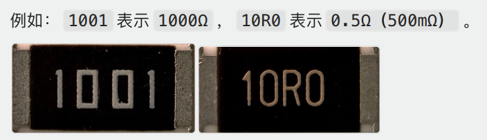
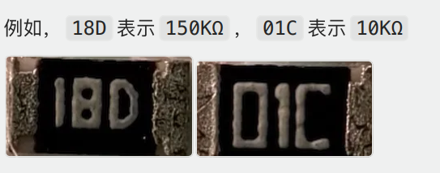
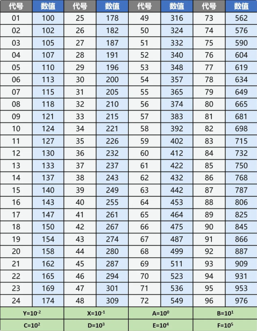
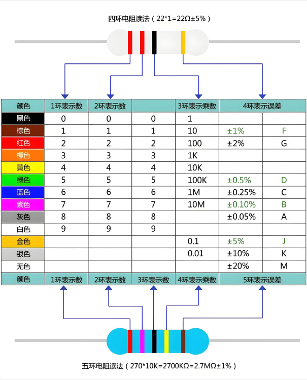
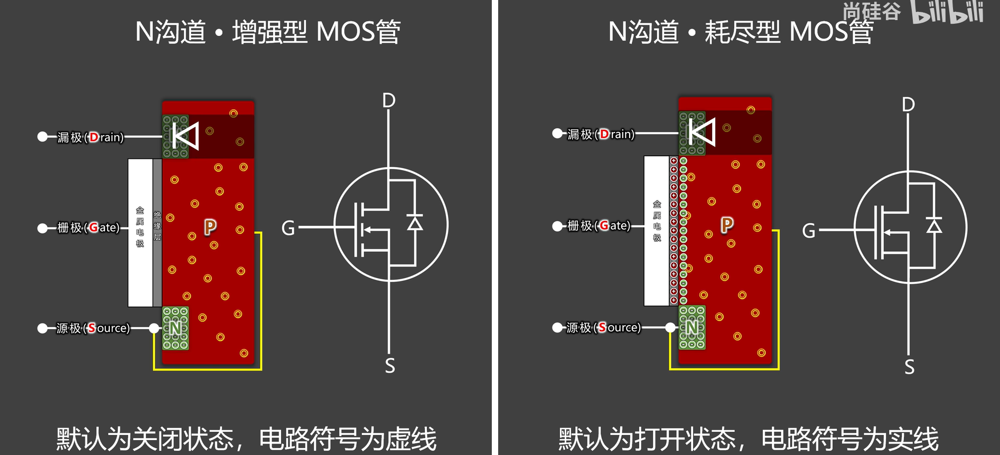
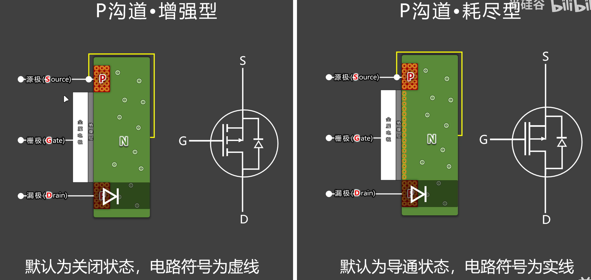

##### 一、电阻识别

###### 1.直标法

​	将电阻器的：阻值、精度、额定功率等直接标注在电阻器外表上

###### 2.三位数字代码

​	⼀般⽤于 ±5% 精度的电阻，它的前两位是有效数字，第三位表示在有效数字后⾯所加“0”的个数，这⼀位不会出现字⺟，其中 R 表示⼩数点。  

###### 3.四位数字代码

​	⼀般⽤于 ±1% 精度的电阻，它的前三位是有效数字，第四位表示在有效数字后⾯所加“0”的个数，这⼀位不会出现字⺟。其中 R 表示⼩数点。  

###### 4.精密标注法

​	⼀般⽤于为 ±0.1% 精度的电阻，精密标注法是由两位数字加⼀位字⺟表示  

精密电阻阻值对照表

###### 5.色环法

​	⽤不同颜⾊的⾊环来表示阻值和精度。⼀般来说，电阻器上会有4个或5个⾊环，每个⾊环代表⼀个数字或⼀个特定的系数，根据⾊环的位置和颜⾊可以确定电阻的阻值和精度。  

​		因印刷⼯艺、以及⾊差问题，⼀般很少读⾊环，通常直接⽤万⽤表测量。  

##### 

